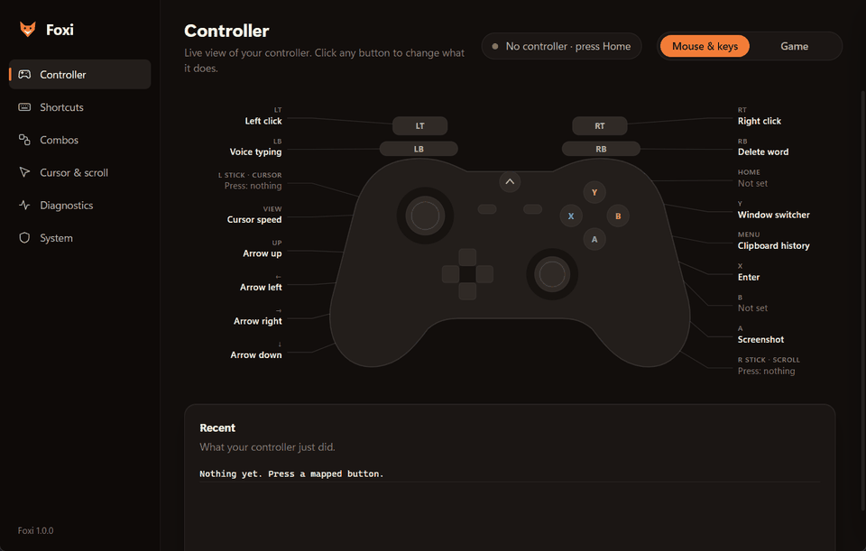

<p align="center"></p>

<h1 align="center">Foxi</h1>
<p align="center"><b>Use your game controller as a mouse and keyboard on Windows 11.</b><br>
Point, click, scroll, dictate, delete words and switch windows from the couch, then flip one switch and it's a normal controller again for games.</p>

<p align="center"><a href="../../releases/latest"><b>⬇ Download Foxi.exe</b></a> · one portable file, no install</p>

<p align="center"></p>

## What it does

- **Controller → mouse.** Stick moves the cursor with a proper response curve (slow and precise on a small tilt, fast on full tilt, extra boost when you hold the edge). Triggers are left/right click; hold to drag and select. The other stick scrolls, or set **both** sticks as cursor and push both to scroll.
- **Buttons → shortcuts.** Every button and combo is remappable: keys, repeating keys, mouse buttons, programs, the Alt+Tab window switcher, cursor-speed presets (like a mouse DPI button), and a picker of **Windows features**: voice typing, screenshot, clipboard history, emoji panel, task view, snapping, virtual desktops and more.
- **One switch for games.** Press both sticks in (L3 + R3): *Mouse & keys* ⇄ *Game*. The controller buzzes twice / three times so you know which.
- **Windows stops fighting you.** Windows 11 reacts to controllers by itself (moves focus between terminal tabs, closes voice typing). Foxi uses the bundled [HidHide](https://github.com/nefarius/HidHide) driver so only Foxi sees the controller in Mouse & keys mode; Game mode hands it back to games.
- **Nice cursors while you drive.** Optional macOS/Posy cursor look in Mouse & keys mode; your own cursors come back in Game mode or when Foxi closes.
- **Diagnostics built in.** Live stick/trigger/button tester plus timed tests: polling rate, drift & jitter, range & circularity, deadzone, trigger range, rumble, and the latency Foxi adds.
- **Portable.** One `Foxi.exe`; settings live in a `data` folder next to it.

## Default layout

| Button | Does | Button | Does |
|---|---|---|---|
| Left stick | Cursor | Right stick | Scroll |
| LT / RT | Left / right click (hold to drag) | D-pad | Arrow keys (repeat when held) |
| A | Space | B | Tab |
| X | Enter | Y | Escape |
| LB | Voice typing (Win+H) | RB | Backspace · hold = delete whole words |
| View | Cycle cursor speed | Menu | Quick menu (Copy, Paste, Select all, Paste image, /resume, /compact, /goal, …) |
| L3 + B | Screenshot (Win+Shift+S) | L3 + Y | Window switcher (keep L3 held, tap Y to step) |
| L3 + R3 | Mouse & keys ⇄ Game | | |

L3 / R3 are the stick clicks; on pads with back buttons (like the EvoFox One S) you can set those to send L3 / R3 and hold them with your middle fingers.

Change any of it in the app: click a button on the controller picture, or press **Record** and hold the buttons you want.

## Getting started

1. Plug in the controller (or its wireless dongle). Any **XInput** controller works: Xbox pads and the many third-party pads that show up as one (tested with an EvoFox One S in 2.4 GHz mode).
2. Run `Foxi.exe` and accept the admin prompt. Admin is needed so Foxi can also control elevated windows and use HidHide.
3. Optional but recommended: **System → Install HidHide** (one-time, may need a reboot), then unplug and replug the dongle once.

Requirements: Windows 10/11 x64, and the Edge WebView2 runtime (already part of Windows 11).

## Build from source

Everything (Python, packages, caches) stays inside the project folder.

```bat
setup.bat    :: one-time: downloads Python 3.12, packages and the HidHide installer into this folder
build.bat    :: runs the self-tests, then builds dist\Foxi.exe
```

Run from source with `.venv\Scripts\python foxi.py`. The engine is plain Python + ctypes (XInput, SendInput); the window is [pywebview](https://pywebview.flowrl.com/) showing `ui/index.html`.

| File | What |
|---|---|
| `engine.py` | Controller loop: mappings, cursor, scroll, modes, HidHide, cursor packs |
| `diag.py` | Diagnostics tests and their analysis |
| `foxi.py` | Window host and the API the page calls |
| `ui/index.html` | The whole interface (HTML/CSS/JS, no build step) |

## Credits

- [HidHide](https://github.com/nefarius/HidHide) by Nefarius Software Solutions (MIT), bundled installer.
- [pywebview](https://github.com/r0x0r/pywebview) (BSD-3-Clause), [PyInstaller](https://pyinstaller.org).

## License

MIT, see [LICENSE](LICENSE).
